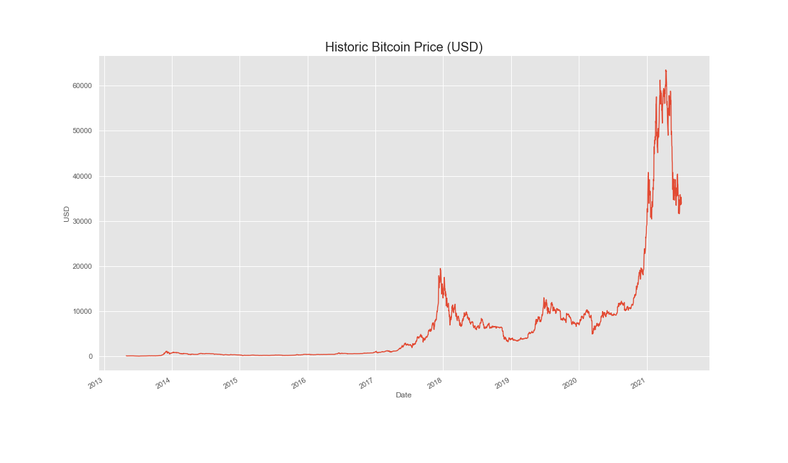
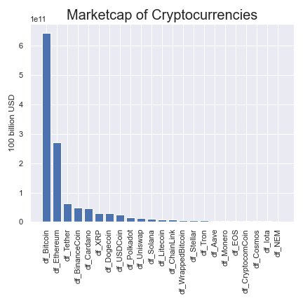
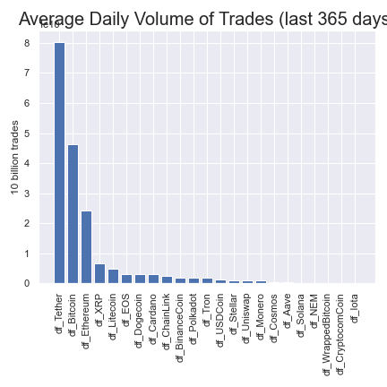
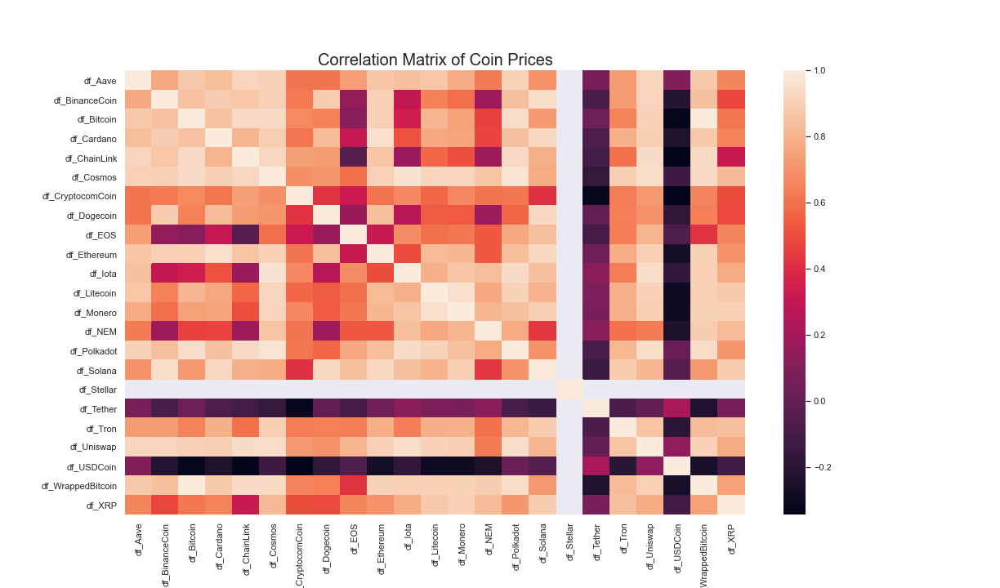
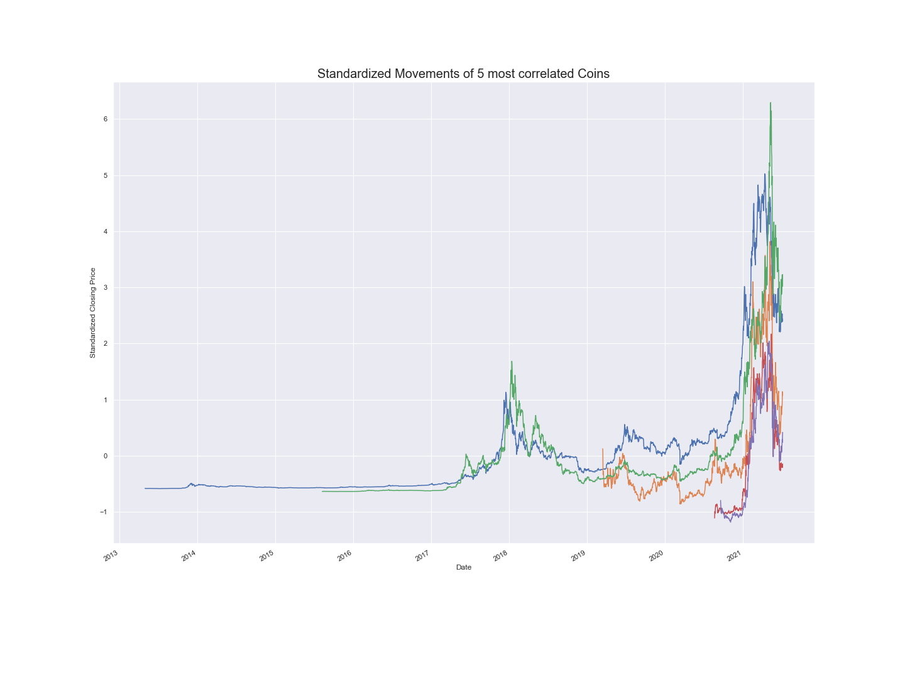
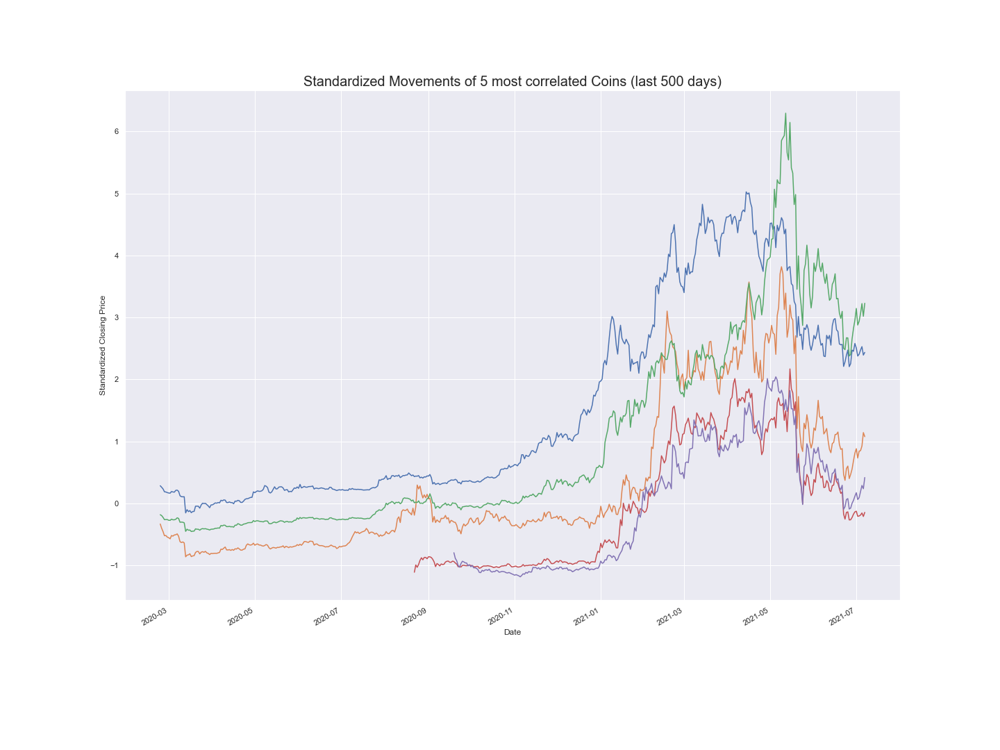

## Capstone 1: An Analysis of Historic Cryptocurrency Prices

###### Jay Kwon  

**<u>Goal</u>:** 
* perform Exploratory Data Analysis on historical prices of cryptocurrencies
	- filter dataset to rows and columns of interest and make insightful visualizations
* identify potential relationships for deeper research and machine learning application
    - in particular, how do other coin prices move relative to Bitcoin (BTC)?
 

**<u>Dataset</u>:** "Cryptocurrency Historical Prices" dataset from Kaggle:
https://www.kaggle.com/sudalairajkumar/cryptocurrencypricehistory

  **Historic Prices of top 23 Cryptocurrencies by marketcap**
* Date
* daily Prices in USD (High, Low, Open, Close) dating back to April, 2013 (for BTC)
* Volume of daily transactions
* Market Capitalization
   
* additional columns derived: daily price change, percent change, price up/down, standardized closing price
* all numerical data except for the categorical variable 'Up' which represents whether the price went up or not
 

**Why are we interested in how other coins track with Bitcoin (BTC)?** 
- BTC is 46% of the total cryptocurrency market cap, tracks the entire cryptocurrency market well
- very first (oldest) cryptocurrency created in 2009 (most historic data for this currency)
- most trusted, widely-used cryptocurrency

  
<ins>Historic Bitcoin Price:</ins>

- 2 major bubbles: 2017 and 2021
- BTC tracks entire crypto market well
- note on scale: Bitcoin(BTC) in the 34,000 USD, Ethereum 2,100 USD, Cardano 1.21 USD , Dogecoin 0.19 USD
    - wide range (orders of magnitude)
 
 

<ins>Cryptocurrencies by Marketcap and Volume</ins> 
 
- coins with the largest marketcaps: Bitcoin (46%), Ethereum (17%), Tether (4.8%), Binance Coin (4.0%), Cardano (2.9%)
- largest average daily volume: Tether, Bitcoin, Ethereum, XRP, Litecoin

  

<ins>Correlation Matrix of Cryptocurrency Prices:</ins> 

- stable coins (Tether, USDCoin) are uncorrelated or negatively correlated with other coins
- coins with the highest correlations: Polkadot, Uniswap, Cosmos, Ethereum all have correlations that are > 0.90

  

<ins>Standardized Movements of 5 most correlated Coins</ins>

- Legend:
    - Bitcoin (2013): blue
    - Ethereum (2015): green
    - Cosmos (2019): orange
    - Uniswap (2020): red
    - Polkadot (2020): purple

  

<ins>Standardized Movements of last 500 days</ins>

- can visually confirm that that highly correlated coins track together

  

**<u>Future Studies</u>:**
* make the time series data stationary by removing seasonality and trends
* test for changes before and after big events like the onset of Covid-19 pandemic
* fit predictive models with price as outcome
* incorporate other financial data like interest rate, unemployment rate, and S&P 500 data as possible predictors
* look at more obscure coins with small marketcaps